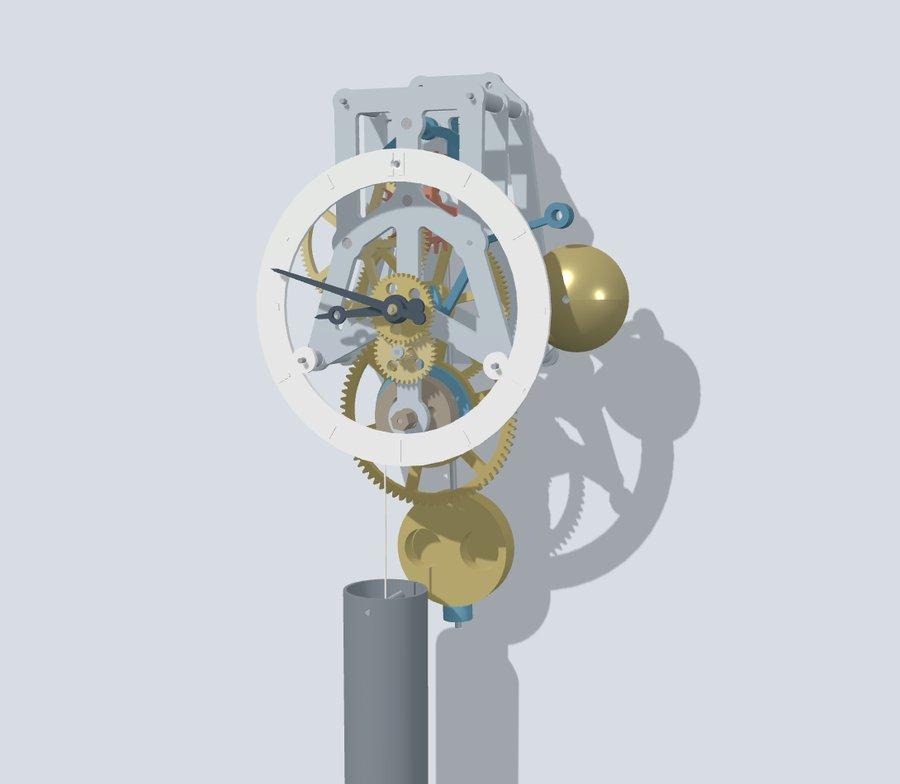
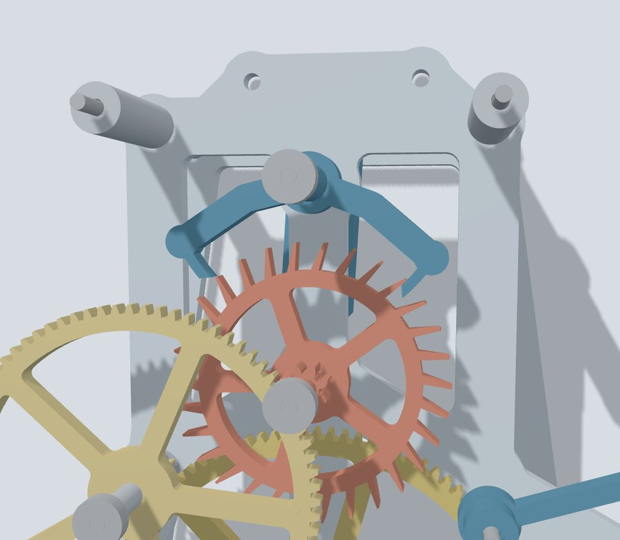
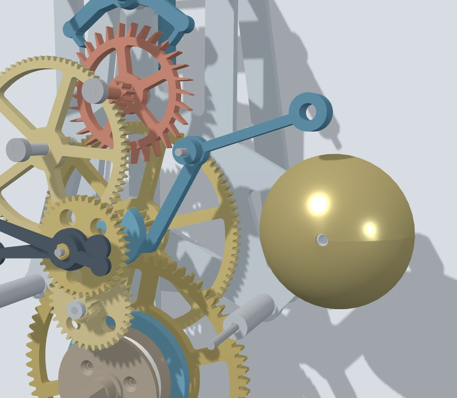
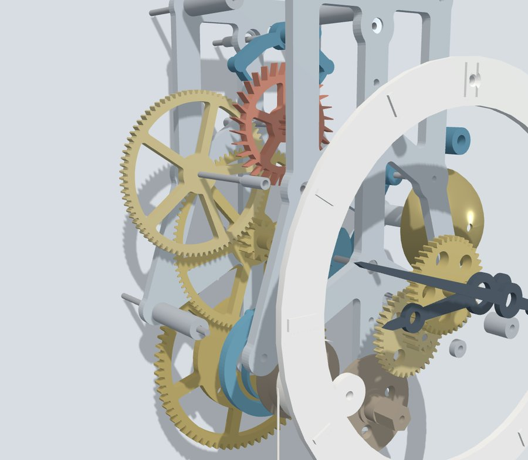
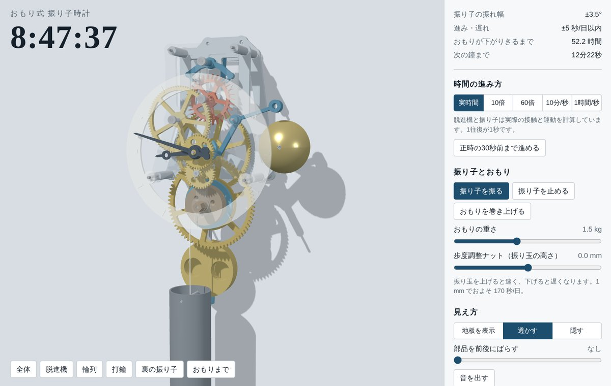

# pendulum-clock — おもり式振り子時計（3Dプリント用CADとブラウザシミュレーター）

おもりで動き、1時間ごとに鐘を打つ振り子時計です。3Dプリンタで部品を刷り、市販のベアリングと丸棒で組み立てる前提で設計しました。
同じ設計スクリプトから、組立状態の STEP、部品ごとの STEP / STL、ブラウザで動く three.js シミュレーターを書き出しています。

*A weight-driven pendulum clock with an hourly bell, designed for 3D printing. This repository contains the CAD data (STEP/STL), the Python (CadQuery) scripts that generate it, and a browser simulator built with three.js. Documentation is in Japanese.*

> [!WARNING]
> **実機での動作は未確認です。** 歯車のかみ合い、部品同士の干渉、脱進機の動きは計算で確認しましたが、印刷して組み立ててはいません。はめあいの公差、摩擦、おもりの重さは、印刷後の調整が前提です。



## シミュレーター

[`index.html`](index.html) をブラウザで開くと、時計が実時間で動き始めます。1ファイルに形状データと計算コードが入っています。表示用ライブラリ（three.js r128）を CDN から読み込むので、インターネット接続が必要です。

GitHub Pages を有効にすると（Settings → Pages → Branch: `main` / root）、`https://yukinoshitaworks.github.io/pendulum-clock/` でそのまま開けます。

| 脱進機 | 打鐘 | 部品を前後にばらした表示 |
|---|---|---|
|  |  |  |

- **60倍速まで**は、ガンギ車の歯とアンクルの爪の接触と、振り子の運動を毎ステップ計算しています。おもりを軽くすると振れ幅が落ちて止まる、ナットを動かすと進み遅れが変わる、といった挙動はこの計算の結果です。
- **10分/秒以上**の早送りは接触計算を省いた簡易表示です。
- 振り子の減衰と駆動力の大きさは実測ではなく、仮に置いた値です。ハンマーの落下とベルの揺れは演出です。
- 操作：時間の進み方、おもりの巻き上げと重さ、振り子の歩度調整ナット、地板の表示／透過／非表示、部品の分解表示、音、視点の切替。部品にカーソルを置くと名前が出ます。



## 主な仕様

| 項目 | 値 |
|---|---|
| 振り子 | 周期 1 秒（支点から振り玉中心まで約 250 mm、ナットで調整） |
| 脱進機 | グラハム式デッドビート。ガンギ車 30 枚（先端径 60 mm）、7.5 歯またぎ、リフト 3°／ロック 1.5°／ドロップ 2° |
| 輪列 | 一番車 72 → カナ 12、二番車 96 → カナ 8、三番車 80 → ガンギカナ 8（インボリュート、圧力角 20°、m1.5 / m1.0） |
| 日の裏 | 筒カナ 12 → 日の裏車 36、カナ 10 → 筒車 40 |
| 動力 | 巻胴 φ40、ひも 9 巻きで約 54 時間、おもり約 1.5 kg、降下量 約 1.15 m |
| 鐘 | 二番軸の渦巻きカムがハンマーを 1 時間かけて持ち上げ、正時に 1 回打つ（時の数は打ち分けない） |
| 印刷部品 | 33 種・41 個、合計 約 447 cm³。最大は後ろ地板 166 × 198 mm（220 × 220 mm のベッドに収まる） |
| 購入品 | ベアリング 623ZZ ×8、φ3 丸棒、M3・M4 全ねじ、ねじ類、金属ベルのドーム（φ55〜60）、ひも、おもりの中身。目安 約 8,800 円（2026年10月の調べ） |

## リポジトリの構成

```
index.html                     ブラウザシミュレーター（1ファイル）
cad/
  README.md                    印刷部品表・購入品・組立の順番・調整
  pendulum_clock_assembly.step 組立状態の全体モデル（63部品、部品名・色つき、約22 MB）
  parts_step/                  印刷部品の STEP（33ファイル、印刷する向き）
  parts_stl/                   印刷部品の STL（33ファイル、同じ向き）
source/
  design.py                    寸法と幾何の定義（軸の位置、インボリュート歯形、脱進機、打鐘カム）
  build_cad.py                 立体化・干渉チェック・STEP/STL/メッシュの書き出し
docs/
  manual-ja.pdf                生成ファイルの説明・組立説明書・部品と費用・確認方法・参考文献（15ページ）
images/                        README用の画像
```

## 印刷と組立

- `cad/parts_stl/` の STL をそのままスライサーに入れられます。ファイル名の末尾が `_x4` などのものは、その数だけ印刷します。
- 印刷の目安：ノズル 0.4 mm、積層 0.2 mm（歯車・ガンギ車・アンクルは 0.12〜0.16 mm）。コハゼ板は PETG 推奨。
- 組立手順（図つき）、調整（ビート合わせ、歩度、止まるときの確認箇所）、部品と概算費用は [`docs/manual-ja.pdf`](docs/manual-ja.pdf) にあります。要点は [`cad/README.md`](cad/README.md) にもまとめています。

## CAD を作り直す

```bash
pip install cadquery shapely numpy
cd source
python3 design.py              # 歯車のかみ合いと回転比を表示
python3 build_cad.py check     # 部品同士の干渉だけ調べる
python3 build_cad.py export    # STEP・STL・メッシュを source/out/ に書き出す（CLOCK_OUT で変更可）
python3 build_cad.py all       # 干渉チェックと書き出しの両方
```

プリンタに合わせて変えることが多い値：`design.py` の `BACKLASH`（歯厚の減らし量、初期値 0.12 mm）、`build_cad.py` の `ROD_PRESS` / `ROD_FREE`（φ3 丸棒の圧入穴と遊び穴）、ベアリング穴（623ZZ 用 φ10.1）。

シミュレーターの HTML を組み立てるスクリプトは含んでいません。計算と画面のコードは `index.html` の中にあります。形状を変えた場合、シミュレーターへの反映には別途作業が必要です。

## 確認したこと・していないこと

確認は、すべて計算と描画で行いました。

- **歯車のかみ合い**：歯形を 2D の輪郭にして回し、5 組とも重なりゼロ、最小すき間 約 0.11 mm。
- **部品同士の干渉**：全 63 部品を組立姿勢に置いて交差体積を計算し、ゼロ（丸棒と圧入穴の組は対象外）。
- **脱進機**：ガンギ車とアンクルの 2D 形状を回して、ロック・持ち上げ・ドロップの順序と角度を確認。シミュレーターで、ナットやおもりを変えたときの振れ幅と進み遅れを確認。

確認していないこと：印刷精度とはめあい、摩擦、おもりの必要量、Fusion での読み込み、スライス結果、振り子やハンマーが動いている途中の立体干渉。詳しくは [`docs/manual-ja.pdf`](docs/manual-ja.pdf) の 12 章を参照してください。

## 参考文献

設計に使った式と作図の方法は、時計学と機械工学の一般的な知識によるものです。以下は、その出典にあたる文献を後から調べて対応づけたものです（書誌事項は2026年10月9日に確認）。

1. Christiaan Huygens, *Horologium Oscillatorium*, Paris, 1673. — 振り子時計の原理、周期の振れ幅依存
2. A. L. Rawlings, *The Science of Clocks and Watches*, Pitman, 1944（第3版は英国時計協会 BHI）. — 輪列と脱進機の理論
3. Philip Woodward, *My Own Right Time: An Exploration of Clockwork Design*, Oxford University Press, 1995. — 脱進機誤差、振り子の Q 値
4. Robert J. Matthys, *Accurate Clock Pendulums*, Oxford University Press, 2004. [doi:10.1093/acprof:oso/9780198529712.001.0001](https://doi.org/10.1093/acprof:oso/9780198529712.001.0001) — 振り子の Q 値と空気抵抗
5. A. A. Andronov, A. A. Vitt, S. E. Khaikin, *Theory of Oscillators*, Pergamon Press, 1966. — 時計を自励振動系として扱うモデル
6. Peter Hoyng, “Dynamics and performance of clock pendulums”, [arXiv:1501.03673](https://arxiv.org/abs/1501.03673), 2015. — 駆動・減衰振り子の数値モデル
7. W. J. Gazeley, *Clock and Watch Escapements*, Robert Hale, 1992. — グラハム式脱進機の作図
8. Mark Headrick, [*Clock and Watch Escapement Mechanics*](https://abbeyclock.com/TToc.htm)（Web公開）. — 脱進機の力学の数値的な扱い
9. Laurie Penman, *The Clock Repairer's Handbook*, Skyhorse Publishing, 2010. — 打方、ビート合わせ、調整の実務
10. [ISO 21771-1:2024](https://www.iso.org/standard/84949.html), *Cylindrical involute gears and gear pairs — Part 1: Concepts and geometry*. — インボリュート歯形、転位、歯厚

使用ソフトウェア：[CadQuery](https://github.com/CadQuery/cadquery)（[doi:10.5281/zenodo.8091097](https://doi.org/10.5281/zenodo.8091097)）、[Open CASCADE Technology](https://dev.opencascade.org)、[Shapely](https://shapely.readthedocs.io)、[three.js](https://github.com/mrdoob/three.js) r128。

## 作成について

設計スクリプト、CAD データ、シミュレーター、説明書は、Anthropic の AI アシスタント Claude との対話で作成しました。
